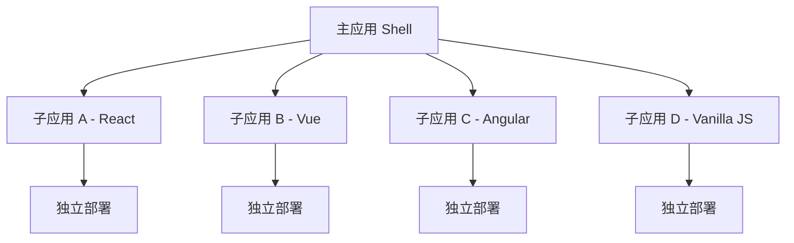
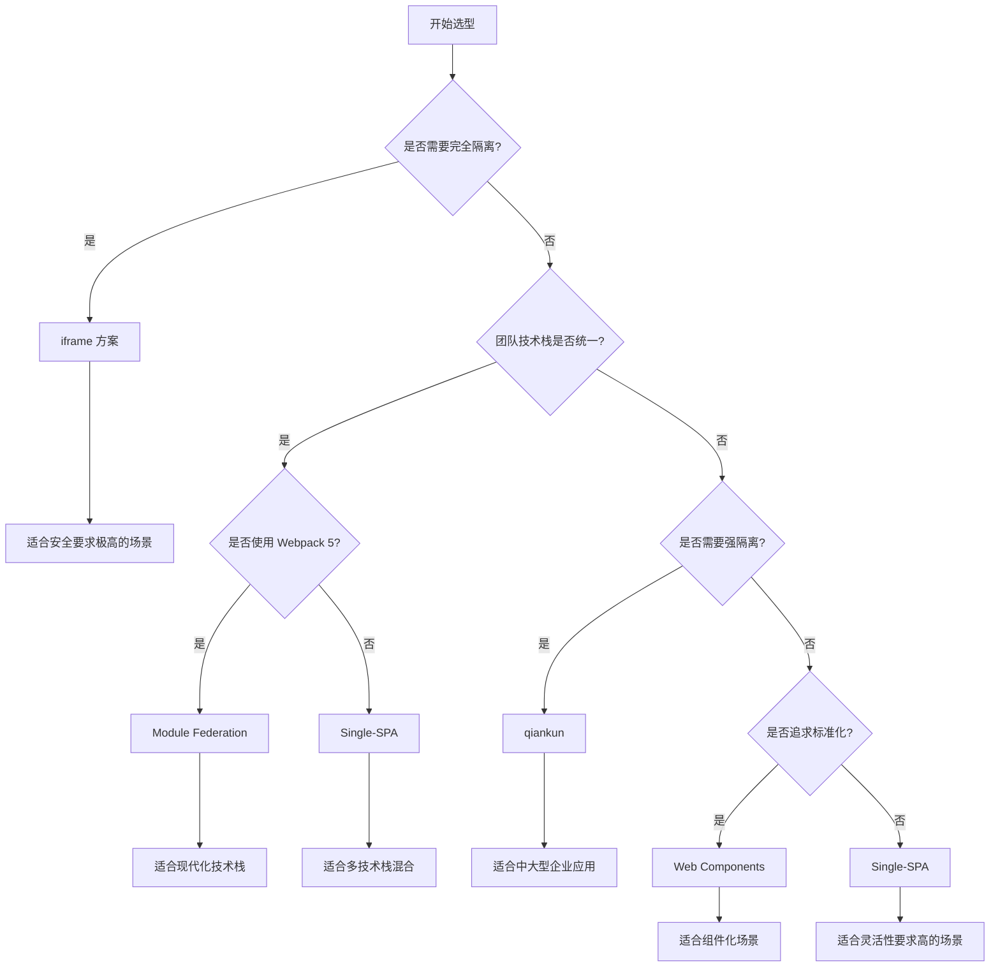

# 微前端最佳实践详细指南

## 目录

1. [微前端概述](#微前端概述)
2. [主流微前端方案对比](#主流微前端方案对比)
3. [qiankun 详细实践](#qiankun-详细实践)
4. [Module Federation 实践](#module-federation-实践)
5. [Single-SPA 实践](#single-spa-实践)
6. [iframe 方案实践](#iframe-方案实践)
7. [Web Components 方案](#web-components-方案)
8. [方案选型指南](#方案选型指南)
9. [最佳实践总结](#最佳实践总结)
10. [常见问题与解决方案](#常见问题与解决方案)

## 微前端概述

### 什么是微前端

微前端是一种类似于微服务的架构，它将前端应用分解为一些更小、更简单的能够独立开发、测试、部署的应用，而在用户看来仍然是内聚的单个产品。

### 微前端的核心价值

- **技术栈无关**：主框架不限制接入应用的技术栈
- **独立开发部署**：各个团队可以独立开发和部署
- **增量升级**：可以渐进式地升级老系统
- **独立运行时**：每个子应用都有独立的运行时状态

### 微前端架构模式



## 主流微前端方案对比

### 方案对比表

| 特性 | qiankun | Module Federation | Single-SPA | iframe | Web Components |
|------|---------|-------------------|------------|--------|----------------|
| **技术栈无关** | ✅ | ✅ | ✅ | ✅ | ✅ |
| **样式隔离** | ✅ | ❌ | ❌ | ✅ | ✅ |
| **JS 隔离** | ✅ | ❌ | ❌ | ✅ | ✅ |
| **通信机制** | ✅ | ✅ | ✅ | ❌ | ✅ |
| **SEO 友好** | ✅ | ✅ | ✅ | ❌ | ✅ |
| **开发体验** | ⭐⭐⭐⭐ | ⭐⭐⭐⭐⭐ | ⭐⭐⭐ | ⭐⭐ | ⭐⭐⭐ |
| **性能** | ⭐⭐⭐⭐ | ⭐⭐⭐⭐⭐ | ⭐⭐⭐⭐ | ⭐⭐ | ⭐⭐⭐⭐ |
| **学习成本** | ⭐⭐⭐ | ⭐⭐⭐⭐ | ⭐⭐⭐⭐ | ⭐ | ⭐⭐⭐ |
| **生态成熟度** | ⭐⭐⭐⭐⭐ | ⭐⭐⭐⭐ | ⭐⭐⭐⭐ | ⭐⭐⭐⭐⭐ | ⭐⭐⭐ |

### 详细对比分析

#### 1. qiankun
**优势：**
- 完善的沙箱机制，提供 JS 和 CSS 隔离
- 丰富的生命周期钩子
- 良好的中文文档和社区支持
- 基于 single-spa，稳定性好

**劣势：**
- 主要面向中国开发者，国际化程度较低
- 对老旧浏览器支持有限
- 沙箱机制可能影响性能

#### 2. Module Federation
**优势：**
- Webpack 5 原生支持，配置简单
- 运行时动态加载，性能优秀
- 支持依赖共享，减少重复加载
- 开发体验极佳

**劣势：**
- 依赖 Webpack 5
- 样式和 JS 隔离需要额外处理
- 相对较新，生态还在发展

#### 3. Single-SPA
**优势：**
- 微前端领域的先驱，生态成熟
- 灵活的路由机制
- 支持多种框架
- 国际化程度高

**劣势：**
- 需要手动处理样式和 JS 隔离
- 配置相对复杂
- 学习曲线较陡

#### 4. iframe
**优势：**
- 天然的隔离性
- 实现简单
- 兼容性好

**劣势：**
- 通信困难
- SEO 不友好
- 性能问题
- 用户体验差（刷新、前进后退等）

#### 5. Web Components
**优势：**
- 浏览器原生支持
- 真正的组件化
- 样式和逻辑完全隔离

**劣势：**
- 浏览器兼容性问题
- 生态相对不成熟
- 与现有框架集成复杂

## qiankun 详细实践

### 基础架构设计

```typescript
// 主应用架构
interface MicroAppConfig {
  name: string;
  entry: string;
  container: string;
  activeRule: string;
  props?: Record<string, any>;
}

// 应用注册配置
const microApps: MicroAppConfig[] = [
  {
    name: 'react-app',
    entry: '//localhost:3001',
    container: '#subapp-viewport',
    activeRule: '/react',
    props: {
      routerBase: '/react',
      getGlobalState: () => globalState,
    }
  },
  {
    name: 'vue-app',
    entry: '//localhost:3002',
    container: '#subapp-viewport',
    activeRule: '/vue',
    props: {
      routerBase: '/vue',
      getGlobalState: () => globalState,
    }
  }
];
```

### 主应用配置

```typescript
// main.ts - 主应用入口
import { registerMicroApps, start, initGlobalState, MicroAppStateActions } from 'qiankun';

// 全局状态管理
const initialState = {
  user: null,
  theme: 'light',
  permissions: [],
  token: localStorage.getItem('token'),
};

const actions: MicroAppStateActions = initGlobalState(initialState);

// 监听全局状态变化
actions.onGlobalStateChange((state, prev) => {
  console.log('全局状态变更：', prev, state);
  // 同步到本地存储
  if (state.token !== prev.token) {
    localStorage.setItem('token', state.token || '');
  }
});

// 注册微应用
registerMicroApps(
  [
    {
      name: 'react-app',
      entry: process.env.NODE_ENV === 'development' 
        ? '//localhost:3001' 
        : '//your-domain.com/react-app',
      container: '#subapp-viewport',
      activeRule: '/react',
      props: {
        routerBase: '/react',
        globalState: actions,
      }
    },
    {
      name: 'vue-app',
      entry: process.env.NODE_ENV === 'development' 
        ? '//localhost:3002' 
        : '//your-domain.com/vue-app',
      container: '#subapp-viewport',
      activeRule: '/vue',
      props: {
        routerBase: '/vue',
        globalState: actions,
      }
    }
  ],
  {
    beforeLoad: [
      (app) => {
        console.log('before load', app.name);
        // 显示加载状态
        showLoading();
        return Promise.resolve();
      }
    ],
    beforeMount: [
      (app) => {
        console.log('before mount', app.name);
        return Promise.resolve();
      }
    ],
    afterMount: [
      (app) => {
        console.log('after mount', app.name);
        // 隐藏加载状态
        hideLoading();
        return Promise.resolve();
      }
    ],
    beforeUnmount: [
      (app) => {
        console.log('before unmount', app.name);
        return Promise.resolve();
      }
    ],
    afterUnmount: [
      (app) => {
        console.log('after unmount', app.name);
        return Promise.resolve();
      }
    ]
  }
);

// 启动 qiankun
start({
  prefetch: 'all', // 预加载策略
  sandbox: {
    strictStyleIsolation: false, // 严格样式隔离
    experimentalStyleIsolation: true, // 实验性样式隔离
  },
  singular: false, // 是否为单实例场景
  fetch: customFetch, // 自定义 fetch
});

// 自定义 fetch 函数
function customFetch(url: string, options?: RequestInit) {
  // 添加认证头
  const token = localStorage.getItem('token');
  if (token) {
    options = {
      ...options,
      headers: {
        ...options?.headers,
        'Authorization': `Bearer ${token}`,
      },
    };
  }
  return window.fetch(url, options);
}

function showLoading() {
  const loading = document.getElementById('loading');
  if (loading) loading.style.display = 'block';
}

function hideLoading() {
  const loading = document.getElementById('loading');
  if (loading) loading.style.display = 'none';
}
```

### React 子应用配置

```typescript
// React 子应用 - src/index.tsx
import React from 'react';
import ReactDOM from 'react-dom';
import { BrowserRouter } from 'react-router-dom';
import App from './App';

interface QiankunProps {
  container?: HTMLElement;
  routerBase?: string;
  globalState?: any;
}

let root: any = null;

// 渲染函数
function render(props: QiankunProps = {}) {
  const { container, routerBase = '/' } = props;
  const dom = container ? container.querySelector('#root') : document.querySelector('#root');
  
  root = ReactDOM.createRoot(dom);
  root.render(
    <BrowserRouter basename={routerBase}>
      <App globalState={props.globalState} />
    </BrowserRouter>
  );
}

// 独立运行时直接渲染
if (!(window as any).__POWERED_BY_QIANKUN__) {
  render();
}

// 微前端生命周期
export async function bootstrap() {
  console.log('React app bootstraped');
}

export async function mount(props: QiankunProps) {
  console.log('React app mount', props);
  render(props);
}

export async function unmount(props: QiankunProps) {
  console.log('React app unmount', props);
  if (root) {
    root.unmount();
    root = null;
  }
}

// 可选：更新生命周期
export async function update(props: QiankunProps) {
  console.log('React app update', props);
}
```

```typescript
// React 子应用 - App.tsx
import React, { useEffect, useState } from 'react';
import { Routes, Route, Link } from 'react-router-dom';

interface AppProps {
  globalState?: any;
}

const App: React.FC<AppProps> = ({ globalState }) => {
  const [state, setState] = useState<any>({});

  useEffect(() => {
    if (globalState) {
      // 监听全局状态变化
      globalState.onGlobalStateChange((newState: any) => {
        setState(newState);
      });

      // 获取初始状态
      setState(globalState.getGlobalState());
    }
  }, [globalState]);

  const updateGlobalState = () => {
    if (globalState) {
      globalState.setGlobalState({
        ...state,
        user: { name: 'React User', id: 1 },
      });
    }
  };

  return (
    <div className="react-app">
      <nav>
        <Link to="/">首页</Link>
        <Link to="/about">关于</Link>
        <Link to="/dashboard">仪表板</Link>
      </nav>
      
      <div className="content">
        <h1>React 微应用</h1>
        <p>当前用户: {state.user?.name || '未登录'}</p>
        <button onClick={updateGlobalState}>更新全局状态</button>
        
        <Routes>
          <Route path="/" element={<Home />} />
          <Route path="/about" element={<About />} />
          <Route path="/dashboard" element={<Dashboard />} />
        </Routes>
      </div>
    </div>
  );
};

const Home = () => <div>React 首页</div>;
const About = () => <div>React 关于页</div>;
const Dashboard = () => <div>React 仪表板</div>;

export default App;
```

```javascript
// React 子应用 - webpack.config.js
const { ModuleFederationPlugin } = require('@module-federation/webpack');

module.exports = {
  mode: 'development',
  devServer: {
    port: 3001,
    headers: {
      'Access-Control-Allow-Origin': '*',
      'Access-Control-Allow-Methods': 'GET, POST, PUT, DELETE, PATCH, OPTIONS',
      'Access-Control-Allow-Headers': 'X-Requested-With, content-type, Authorization',
    },
  },
  module: {
    rules: [
      {
        test: /\.tsx?$/,
        use: 'ts-loader',
        exclude: /node_modules/,
      },
      {
        test: /\.css$/,
        use: ['style-loader', 'css-loader'],
      },
    ],
  },
  plugins: [
    new ModuleFederationPlugin({
      name: 'reactApp',
      filename: 'remoteEntry.js',
      exposes: {
        './App': './src/App',
      },
      shared: {
        react: { singleton: true },
        'react-dom': { singleton: true },
      },
    }),
  ],
};
```

### Vue 子应用配置

```typescript
// Vue 子应用 - src/main.ts
import { createApp } from 'vue';
import { createRouter, createWebHistory } from 'vue-router';
import App from './App.vue';
import routes from './routes';

interface QiankunProps {
  container?: HTMLElement;
  routerBase?: string;
  globalState?: any;
}

let app: any = null;
let router: any = null;

function render(props: QiankunProps = {}) {
  const { container, routerBase = '/' } = props;
  
  router = createRouter({
    history: createWebHistory(routerBase),
    routes,
  });

  app = createApp(App);
  app.use(router);
  
  // 注入全局状态
  if (props.globalState) {
    app.provide('globalState', props.globalState);
  }

  const dom = container ? container.querySelector('#app') : '#app';
  app.mount(dom);
}

// 独立运行
if (!(window as any).__POWERED_BY_QIANKUN__) {
  render();
}

// 微前端生命周期
export async function bootstrap() {
  console.log('Vue app bootstraped');
}

export async function mount(props: QiankunProps) {
  console.log('Vue app mount', props);
  render(props);
}

export async function unmount() {
  console.log('Vue app unmount');
  if (app) {
    app.unmount();
    app = null;
    router = null;
  }
}
```

```vue
<!-- Vue 子应用 - App.vue -->
<template>
  <div class="vue-app">
    <nav>
      <router-link to="/">首页</router-link>
      <router-link to="/about">关于</router-link>
      <router-link to="/products">产品</router-link>
    </nav>
    
    <div class="content">
      <h1>Vue 微应用</h1>
      <p>当前用户: {{ state.user?.name || '未登录' }}</p>
      <button @click="updateGlobalState">更新全局状态</button>
      
      <router-view />
    </div>
  </div>
</template>

<script setup lang="ts">
import { ref, inject, onMounted } from 'vue';

const globalState = inject('globalState');
const state = ref<any>({});

onMounted(() => {
  if (globalState) {
    // 监听全局状态变化
    globalState.onGlobalStateChange((newState: any) => {
      state.value = newState;
    });

    // 获取初始状态
    state.value = globalState.getGlobalState();
  }
});

const updateGlobalState = () => {
  if (globalState) {
    globalState.setGlobalState({
      ...state.value,
      user: { name: 'Vue User', id: 2 },
    });
  }
};
</script>

<style scoped>
.vue-app {
  padding: 20px;
}

nav {
  margin-bottom: 20px;
}

nav a {
  margin-right: 10px;
  padding: 5px 10px;
  text-decoration: none;
  border: 1px solid #ccc;
  border-radius: 4px;
}

nav a.router-link-active {
  background-color: #007bff;
  color: white;
}
</style>
```

### 样式隔离方案

```css
/* 方案1：CSS Modules */
.container {
  composes: base from './base.css';
  padding: 20px;
}

/* 方案2：Styled Components */
const Container = styled.div`
  padding: 20px;
  background: ${props => props.theme.background};
`;

/* 方案3：CSS-in-JS with emotion */
const containerStyle = css`
  padding: 20px;
  background: #f5f5f5;
`;

/* 方案4：PostCSS 插件自动添加前缀 */
/* 原始 CSS */
.header {
  background: blue;
}

/* 编译后 */
.react-app-header {
  background: blue;
}
```

## Module Federation 实践

### 基础配置

```javascript
// 主应用 webpack.config.js
const ModuleFederationPlugin = require('@module-federation/webpack');

module.exports = {
  mode: 'development',
  devServer: {
    port: 3000,
  },
  plugins: [
    new ModuleFederationPlugin({
      name: 'shell',
      remotes: {
        mfReact: 'mfReact@http://localhost:3001/remoteEntry.js',
        mfVue: 'mfVue@http://localhost:3002/remoteEntry.js',
        mfAngular: 'mfAngular@http://localhost:3003/remoteEntry.js',
      },
      shared: {
        react: { singleton: true },
        'react-dom': { singleton: true },
      },
    }),
  ],
};
```

```javascript
// React 微应用 webpack.config.js
const ModuleFederationPlugin = require('@module-federation/webpack');

module.exports = {
  mode: 'development',
  devServer: {
    port: 3001,
  },
  plugins: [
    new ModuleFederationPlugin({
      name: 'mfReact',
      filename: 'remoteEntry.js',
      exposes: {
        './App': './src/App',
        './Button': './src/components/Button',
        './utils': './src/utils',
      },
      shared: {
        react: { singleton: true },
        'react-dom': { singleton: true },
        lodash: { singleton: true },
      },
    }),
  ],
};
```

### 动态导入组件

```typescript
// 主应用中动态导入微应用
import React, { Suspense, lazy } from 'react';

// 动态导入远程组件
const RemoteReactApp = lazy(() => import('mfReact/App'));
const RemoteVueApp = lazy(() => import('mfVue/App'));
const RemoteButton = lazy(() => import('mfReact/Button'));

const App: React.FC = () => {
  return (
    <div className="app">
      <h1>Module Federation 主应用</h1>
      
      <Suspense fallback={<div>Loading React App...</div>}>
        <RemoteReactApp />
      </Suspense>
      
      <Suspense fallback={<div>Loading Vue App...</div>}>
        <RemoteVueApp />
      </Suspense>
      
      <Suspense fallback={<div>Loading Button...</div>}>
        <RemoteButton text="远程按钮" />
      </Suspense>
    </div>
  );
};

export default App;
```

### 类型安全

```typescript
// types/remotes.d.ts
declare module 'mfReact/App' {
  const App: React.ComponentType;
  export default App;
}

declare module 'mfReact/Button' {
  interface ButtonProps {
    text: string;
    onClick?: () => void;
  }
  const Button: React.ComponentType<ButtonProps>;
  export default Button;
}

declare module 'mfVue/App' {
  const App: any;
  export default App;
}
```

### 共享依赖优化

```javascript
// 高级共享配置
const ModuleFederationPlugin = require('@module-federation/webpack');

module.exports = {
  plugins: [
    new ModuleFederationPlugin({
      name: 'shell',
      shared: {
        react: {
          singleton: true,
          requiredVersion: '^18.0.0',
          eager: true,
        },
        'react-dom': {
          singleton: true,
          requiredVersion: '^18.0.0',
          eager: true,
        },
        '@ant-design/icons': {
          singleton: true,
          requiredVersion: '^4.0.0',
        },
        antd: {
          singleton: true,
          requiredVersion: '^4.0.0',
        },
        moment: {
          singleton: true,
          requiredVersion: '^2.29.0',
        },
        lodash: {
          singleton: true,
          requiredVersion: '^4.17.0',
        },
      },
    }),
  ],
};
```

## Single-SPA 实践

### 根配置

```typescript
// root-config.ts
import { registerApplication, start, LifeCycles } from 'single-spa';

// 注册应用
registerApplication({
  name: 'navbar',
  app: () => System.import<LifeCycles>('navbar'),
  activeWhen: () => true, // 始终激活
});

registerApplication({
  name: 'react-app',
  app: () => System.import<LifeCycles>('react-app'),
  activeWhen: (location) => location.pathname.startsWith('/react'),
});

registerApplication({
  name: 'vue-app',
  app: () => System.import<LifeCycles>('vue-app'),
  activeWhen: (location) => location.pathname.startsWith('/vue'),
});

registerApplication({
  name: 'angular-app',
  app: () => System.import<LifeCycles>('angular-app'),
  activeWhen: (location) => location.pathname.startsWith('/angular'),
});

// 启动 single-spa
start({
  urlRerouteOnly: true,
});
```

### React 应用配置

```typescript
// React 应用 - src/spa-app.tsx
import React from 'react';
import ReactDOM from 'react-dom';
import singleSpaReact from 'single-spa-react';
import App from './App';

const lifecycles = singleSpaReact({
  React,
  ReactDOM,
  rootComponent: App,
  errorBoundary(err, info, props) {
    return <div>发生错误: {err.message}</div>;
  },
});

export const { bootstrap, mount, unmount } = lifecycles;
```

### Vue 应用配置

```typescript
// Vue 应用 - src/spa-app.ts
import { createApp, App as VueApp } from 'vue';
import singleSpaVue from 'single-spa-vue';
import App from './App.vue';

const vueLifecycles = singleSpaVue({
  createApp,
  appOptions: {
    render() {
      return h(App, {
        // 传递给根组件的 props
        name: this.name,
        mountParcel: this.mountParcel,
        singleSpa: this.singleSpa,
      });
    },
  },
});

export const { bootstrap, mount, unmount } = vueLifecycles;
```

## iframe 方案实践

### 基础实现

```typescript
// iframe 微前端管理器
class IframeMicroApp {
  private apps: Map<string, HTMLIFrameElement> = new Map();
  private container: HTMLElement;

  constructor(container: HTMLElement) {
    this.container = container;
  }

  // 注册应用
  registerApp(name: string, url: string) {
    const iframe = document.createElement('iframe');
    iframe.src = url;
    iframe.style.width = '100%';
    iframe.style.height = '100%';
    iframe.style.border = 'none';
    iframe.style.display = 'none';
    
    // 安全设置
    iframe.sandbox = 'allow-scripts allow-same-origin allow-forms allow-popups';
    
    this.container.appendChild(iframe);
    this.apps.set(name, iframe);
  }

  // 激活应用
  activateApp(name: string) {
    // 隐藏所有应用
    this.apps.forEach(iframe => {
      iframe.style.display = 'none';
    });

    // 显示目标应用
    const targetApp = this.apps.get(name);
    if (targetApp) {
      targetApp.style.display = 'block';
    }
  }

  // 卸载应用
  unloadApp(name: string) {
    const iframe = this.apps.get(name);
    if (iframe) {
      this.container.removeChild(iframe);
      this.apps.delete(name);
    }
  }
}

// 使用示例
const container = document.getElementById('micro-app-container')!;
const microAppManager = new IframeMicroApp(container);

microAppManager.registerApp('react-app', 'http://localhost:3001');
microAppManager.registerApp('vue-app', 'http://localhost:3002');

// 路由变化时切换应用
window.addEventListener('popstate', () => {
  const path = window.location.pathname;
  if (path.startsWith('/react')) {
    microAppManager.activateApp('react-app');
  } else if (path.startsWith('/vue')) {
    microAppManager.activateApp('vue-app');
  }
});
```

### 通信机制

```typescript
// 主应用通信管理器
class IframeCommunicator {
  private listeners: Map<string, Function[]> = new Map();

  constructor() {
    window.addEventListener('message', this.handleMessage.bind(this));
  }

  // 发送消息到子应用
  sendToChild(iframe: HTMLIFrameElement, type: string, data: any) {
    iframe.contentWindow?.postMessage({
      type,
      data,
      source: 'parent',
    }, '*');
  }

  // 广播消息到所有子应用
  broadcast(type: string, data: any) {
    const iframes = document.querySelectorAll('iframe');
    iframes.forEach(iframe => {
      this.sendToChild(iframe, type, data);
    });
  }

  // 监听消息
  on(type: string, callback: Function) {
    if (!this.listeners.has(type)) {
      this.listeners.set(type, []);
    }
    this.listeners.get(type)!.push(callback);
  }

  // 处理接收到的消息
  private handleMessage(event: MessageEvent) {
    const { type, data, source } = event.data;
    
    if (source === 'child') {
      const callbacks = this.listeners.get(type);
      if (callbacks) {
        callbacks.forEach(callback => callback(data, event));
      }
    }
  }
}

// 子应用通信工具
class ChildCommunicator {
  // 发送消息到父应用
  sendToParent(type: string, data: any) {
    window.parent.postMessage({
      type,
      data,
      source: 'child',
    }, '*');
  }

  // 监听父应用消息
  onParentMessage(callback: (event: MessageEvent) => void) {
    window.addEventListener('message', (event) => {
      if (event.data.source === 'parent') {
        callback(event);
      }
    });
  }
}
```

## Web Components 方案

### 基础组件定义

```typescript
// 微前端 Web Component 基类
abstract class MicroFrontendElement extends HTMLElement {
  protected shadow: ShadowRoot;
  protected props: Record<string, any> = {};

  constructor() {
    super();
    this.shadow = this.attachShadow({ mode: 'open' });
  }

  // 监听的属性
  static get observedAttributes() {
    return ['data-props'];
  }

  // 属性变化回调
  attributeChangedCallback(name: string, oldValue: string, newValue: string) {
    if (name === 'data-props' && newValue) {
      try {
        this.props = JSON.parse(newValue);
        this.render();
      } catch (e) {
        console.error('Invalid props JSON:', newValue);
      }
    }
  }

  // 连接到 DOM
  connectedCallback() {
    this.render();
  }

  // 断开连接
  disconnectedCallback() {
    this.cleanup();
  }

  // 抽象方法：渲染
  abstract render(): void;

  // 抽象方法：清理
  abstract cleanup(): void;
}

// React 微应用 Web Component
class ReactMicroApp extends MicroFrontendElement {
  private reactRoot: any = null;

  render() {
    // 动态导入 React 应用
    import('./react-app').then(({ default: App }) => {
      import('react').then(React => {
        import('react-dom/client').then(ReactDOM => {
          if (!this.reactRoot) {
            this.reactRoot = ReactDOM.createRoot(this.shadow);
          }
          this.reactRoot.render(React.createElement(App, this.props));
        });
      });
    });
  }

  cleanup() {
    if (this.reactRoot) {
      this.reactRoot.unmount();
      this.reactRoot = null;
    }
  }
}

// Vue 微应用 Web Component
class VueMicroApp extends MicroFrontendElement {
  private vueApp: any = null;

  render() {
    import('./vue-app').then(({ default: App }) => {
      import('vue').then(({ createApp }) => {
        if (this.vueApp) {
          this.vueApp.unmount();
        }
        
        const container = document.createElement('div');
        this.shadow.appendChild(container);
        
        this.vueApp = createApp(App, this.props);
        this.vueApp.mount(container);
      });
    });
  }

  cleanup() {
    if (this.vueApp) {
      this.vueApp.unmount();
      this.vueApp = null;
    }
  }
}

// 注册 Web Components
customElements.define('react-micro-app', ReactMicroApp);
customElements.define('vue-micro-app', VueMicroApp);
```

### 使用 Web Components

```html
<!-- 在主应用中使用 -->
<!DOCTYPE html>
<html>
<head>
  <title>Web Components 微前端</title>
</head>
<body>
  <div id="app">
    <nav>
      <button onclick="showReactApp()">React 应用</button>
      <button onclick="showVueApp()">Vue 应用</button>
    </nav>
    
    <div id="micro-app-container">
      <!-- 动态插入微应用 -->
    </div>
  </div>

  <script>
    function showReactApp() {
      const container = document.getElementById('micro-app-container');
      container.innerHTML = `
        <react-micro-app 
          data-props='{"title": "React 微应用", "user": {"name": "张三"}}'
        ></react-micro-app>
      `;
    }

    function showVueApp() {
      const container = document.getElementById('micro-app-container');
      container.innerHTML = `
        <vue-micro-app 
          data-props='{"title": "Vue 微应用", "user": {"name": "李四"}}'
        ></vue-micro-app>
      `;
    }
  </script>
</body>
</html>
```

## 方案选型指南

### 选型决策树



### 详细选型建议

#### 1. 企业级应用推荐：qiankun
**适用场景：**
- 大型企业应用
- 需要强隔离的多团队协作
- 对稳定性要求高
- 中文团队开发

**技术要求：**
- 支持多种前端框架
- 需要样式和 JS 隔离
- 有复杂的权限控制需求

#### 2. 现代化应用推荐：Module Federation
**适用场景：**
- 使用 Webpack 5 的项目
- 追求最佳性能
- 团队技术栈相对统一
- 需要运行时动态加载

**技术要求：**
- Webpack 5+
- 现代浏览器支持
- 对构建工具有一定掌控力

#### 3. 灵活性优先推荐：Single-SPA
**适用场景：**
- 需要最大灵活性
- 多技术栈混合
- 渐进式迁移老系统
- 国际化团队

**技术要求：**
- 对微前端有深入理解
- 愿意投入更多配置工作
- 需要自定义隔离方案

#### 4. 安全性优先推荐：iframe
**适用场景：**
- 安全要求极高
- 第三方应用集成
- 快速原型验证
- 简单的应用集成

**技术要求：**
- 可以接受性能损失
- 通信需求简单
- 对用户体验要求不高

#### 5. 标准化推荐：Web Components
**适用场景：**
- 追求 Web 标准
- 组件化程度高
- 长期技术规划
- 跨框架组件复用

**技术要求：**
- 现代浏览器环境
- 对新技术接受度高
- 有完善的 polyfill 方案

## 最佳实践总结

### 1. 架构设计原则

#### 单一职责原则
```typescript
// 好的设计：每个微应用职责单一
const microApps = [
  { name: 'user-management', responsibility: '用户管理' },
  { name: 'order-system', responsibility: '订单系统' },
  { name: 'payment-gateway', responsibility: '支付网关' },
];

// 避免：功能过于复杂的微应用
const badMicroApp = {
  name: 'everything-app',
  responsibility: '用户管理 + 订单 + 支付 + 库存 + 报表'
};
```

#### 依赖倒置原则
```typescript
// 定义通信接口
interface MicroAppCommunication {
  emit(event: string, data: any): void;
  on(event: string, callback: Function): void;
  off(event: string, callback: Function): void;
}

// 微应用依赖抽象而非具体实现
class MicroApp {
  constructor(private communication: MicroAppCommunication) {}
  
  sendMessage(data: any) {
    this.communication.emit('message', data);
  }
}
```

### 2. 性能优化策略

#### 预加载策略
```typescript
// 智能预加载
const preloadStrategy = {
  // 空闲时预加载
  idle: () => {
    if ('requestIdleCallback' in window) {
      requestIdleCallback(() => {
        preloadMicroApps(['user-app', 'dashboard']);
      });
    }
  },
  
  // 基于用户行为预加载
  behavioral: () => {
    // 用户悬停在导航链接上时预加载
    document.querySelectorAll('[data-preload]').forEach(link => {
      link.addEventListener('mouseenter', () => {
        const appName = link.dataset.preload;
        preloadMicroApp(appName);
      });
    });
  },
  
  // 基于路由预加载
  route: () => {
    // 当前路由的相邻路由预加载
    const currentRoute = getCurrentRoute();
    const adjacentRoutes = getAdjacentRoutes(currentRoute);
    adjacentRoutes.forEach(route => preloadMicroApp(route.app));
  }
};
```

#### 资源共享优化
```typescript
// 共享依赖管理
const sharedDependencies = {
  react: {
    version: '18.2.0',
    singleton: true,
    eager: true,
  },
  'react-dom': {
    version: '18.2.0',
    singleton: true,
    eager: true,
  },
  antd: {
    version: '4.24.0',
    singleton: true,
    requiredVersion: '^4.20.0',
  },
  moment: {
    version: '2.29.4',
    singleton: true,
    requiredVersion: '^2.29.0',
  }
};

// CDN 资源优化
const cdnResources = {
  react: 'https://unpkg.com/react@18.2.0/umd/react.production.min.js',
  'react-dom': 'https://unpkg.com/react-dom@18.2.0/umd/react-dom.production.min.js',
  antd: 'https://unpkg.com/antd@4.24.0/dist/antd.min.js',
};
```

### 3. 状态管理最佳实践

#### 全局状态设计
```typescript
// 全局状态结构设计
interface GlobalState {
  // 用户信息
  user: {
    id: string;
    name: string;
    avatar: string;
    permissions: string[];
  } | null;
  
  // 应用配置
  config: {
    theme: 'light' | 'dark';
    language: string;
    timezone: string;
  };
  
  // 共享数据
  shared: {
    [key: string]: any;
  };
  
  // 应用间通信
  events: {
    [eventName: string]: any;
  };
}

// 状态管理器
class GlobalStateManager {
  private state: GlobalState;
  private listeners: Map<string, Function[]> = new Map();
  
  constructor(initialState: GlobalState) {
    this.state = { ...initialState };
  }
  
  // 获取状态
  getState(): GlobalState {
    return { ...this.state };
  }
  
  // 更新状态
  setState(updates: Partial<GlobalState>) {
    const prevState = { ...this.state };
    this.state = { ...this.state, ...updates };
    
    // 通知监听者
    this.notifyListeners(prevState, this.state);
  }
  
  // 订阅状态变化
  subscribe(callback: (prevState: GlobalState, newState: GlobalState) => void) {
    const id = Math.random().toString(36);
    if (!this.listeners.has('stateChange')) {
      this.listeners.set('stateChange', []);
    }
    this.listeners.get('stateChange')!.push(callback);
    
    // 返回取消订阅函数
    return () => {
      const callbacks = this.listeners.get('stateChange');
      if (callbacks) {
        const index = callbacks.indexOf(callback);
        if (index > -1) {
          callbacks.splice(index, 1);
        }
      }
    };
  }
  
  private notifyListeners(prevState: GlobalState, newState: GlobalState) {
    const callbacks = this.listeners.get('stateChange');
    if (callbacks) {
      callbacks.forEach(callback => callback(prevState, newState));
    }
  }
}
```

### 4. 错误处理与监控

#### 错误边界设计
```typescript
// React 错误边界
class MicroAppErrorBoundary extends React.Component {
  constructor(props: any) {
    super(props);
    this.state = { hasError: false, error: null };
  }
  
  static getDerivedStateFromError(error: Error) {
    return { hasError: true, error };
  }
  
  componentDidCatch(error: Error, errorInfo: React.ErrorInfo) {
    // 上报错误
    this.reportError(error, errorInfo);
  }
  
  reportError(error: Error, errorInfo?: React.ErrorInfo) {
    // 发送到监控系统
    window.errorReporter?.report({
      type: 'micro-app-error',
      message: error.message,
      stack: error.stack,
      componentStack: errorInfo?.componentStack,
      timestamp: Date.now(),
      userAgent: navigator.userAgent,
      url: window.location.href,
    });
  }
  
  render() {
    if (this.state.hasError) {
      return (
        <div className="error-fallback">
          <h2>微应用加载失败</h2>
          <p>请刷新页面重试，或联系技术支持。</p>
          <button onClick={() => window.location.reload()}>
            刷新页面
          </button>
        </div>
      );
    }
    
    return this.props.children;
  }
}
```

#### 性能监控
```typescript
// 微应用性能监控
class MicroAppPerformanceMonitor {
  private metrics: Map<string, any> = new Map();
  
  // 记录应用加载时间
  recordLoadTime(appName: string, startTime: number, endTime: number) {
    const loadTime = endTime - startTime;
    this.metrics.set(`${appName}_load_time`, loadTime);
    
    // 上报性能数据
    this.reportMetric({
      type: 'load_time',
      appName,
      value: loadTime,
      timestamp: Date.now(),
    });
  }
  
  // 记录应用切换时间
  recordSwitchTime(fromApp: string, toApp: string, switchTime: number) {
    this.metrics.set(`switch_${fromApp}_to_${toApp}`, switchTime);
    
    this.reportMetric({
      type: 'switch_time',
      fromApp,
      toApp,
      value: switchTime,
      timestamp: Date.now(),
    });
  }
  
  // 记录内存使用情况
  recordMemoryUsage() {
    if ('memory' in performance) {
      const memory = (performance as any).memory;
      this.reportMetric({
        type: 'memory_usage',
        usedJSHeapSize: memory.usedJSHeapSize,
        totalJSHeapSize: memory.totalJSHeapSize,
        jsHeapSizeLimit: memory.jsHeapSizeLimit,
        timestamp: Date.now(),
      });
    }
  }
  
  private reportMetric(metric: any) {
    // 发送到监控系统
    fetch('/api/metrics', {
      method: 'POST',
      headers: { 'Content-Type': 'application/json' },
      body: JSON.stringify(metric),
    }).catch(console.error);
  }
}
```

### 5. 安全性最佳实践

#### CSP 配置
```html
<!-- Content Security Policy 配置 -->
<meta http-equiv="Content-Security-Policy" 
      content="
        default-src 'self';
        script-src 'self' 'unsafe-inline' 'unsafe-eval' 
                   https://unpkg.com 
                   https://cdn.jsdelivr.net;
        style-src 'self' 'unsafe-inline' 
                  https://fonts.googleapis.com;
        font-src 'self' 
                 https://fonts.gstatic.com;
        img-src 'self' data: 
                https://images.unsplash.com;
        connect-src 'self' 
                    https://api.example.com;
        frame-src 'self' 
                  https://trusted-domain.com;
      ">
```

#### 输入验证与清理
```typescript
// 输入验证工具
class InputValidator {
  // 验证 URL
  static isValidUrl(url: string): boolean {
    try {
      const urlObj = new URL(url);
      return ['http:', 'https:'].includes(urlObj.protocol);
    } catch {
      return false;
    }
  }
  
  // 清理 HTML
  static sanitizeHtml(html: string): string {
    const div = document.createElement('div');
    div.textContent = html;
    return div.innerHTML;
  }
  
  // 验证微应用配置
  static validateMicroAppConfig(config: any): boolean {
    const required = ['name', 'entry', 'container', 'activeRule'];
    return required.every(field => field in config) &&
           this.isValidUrl(config.entry) &&
           typeof config.name === 'string' &&
           config.name.length > 0;
  }
}
```

## 常见问题与解决方案

### 1. 样式冲突问题

#### 问题描述
不同微应用之间的 CSS 样式相互影响，导致页面显示异常。

#### 解决方案

**方案一：CSS Modules**
```css
/* styles.module.css */
.container {
  padding: 20px;
  background: #f5f5f5;
}

.title {
  font-size: 24px;
  color: #333;
}
```

```typescript
// Component.tsx
import styles from './styles.module.css';

const Component = () => (
  <div className={styles.container}>
    <h1 className={styles.title}>标题</h1>
  </div>
);
```

**方案二：CSS-in-JS**
```typescript
import styled from 'styled-components';

const Container = styled.div`
  padding: 20px;
  background: #f5f5f5;
`;

const Title = styled.h1`
  font-size: 24px;
  color: #333;
`;
```

**方案三：PostCSS 自动前缀**
```javascript
// postcss.config.js
module.exports = {
  plugins: [
    require('postcss-prefixwrap')('.micro-app-react'),
  ],
};
```

### 2. 路由冲突问题

#### 问题描述
主应用和子应用的路由系统冲突，导致页面跳转异常。

#### 解决方案

**qiankun 路由配置**
```typescript
// 主应用路由配置
const routes = [
  {
    path: '/react/*',
    component: () => <div id="react-app-container" />,
  },
  {
    path: '/vue/*',
    component: () => <div id="vue-app-container" />,
  },
];

// 子应用路由配置
const router = createBrowserRouter([
  {
    path: '/',
    element: <Home />,
  },
  {
    path: '/about',
    element: <About />,
  },
], {
  basename: window.__POWERED_BY_QIANKUN__ ? '/react' : '/',
});
```

### 3. 状态同步问题

#### 问题描述
微应用之间的状态同步困难，数据一致性难以保证。

#### 解决方案

**事件总线模式**
```typescript
// 事件总线
class EventBus {
  private events: Map<string, Function[]> = new Map();
  
  on(event: string, callback: Function) {
    if (!this.events.has(event)) {
      this.events.set(event, []);
    }
    this.events.get(event)!.push(callback);
  }
  
  emit(event: string, data: any) {
    const callbacks = this.events.get(event);
    if (callbacks) {
      callbacks.forEach(callback => callback(data));
    }
  }
  
  off(event: string, callback: Function) {
    const callbacks = this.events.get(event);
    if (callbacks) {
      const index = callbacks.indexOf(callback);
      if (index > -1) {
        callbacks.splice(index, 1);
      }
    }
  }
}

// 全局事件总线实例
window.globalEventBus = new EventBus();
```

### 4. 依赖冲突问题

#### 问题描述
不同微应用使用了相同依赖的不同版本，导致运行时错误。

#### 解决方案

**版本锁定策略**
```json
{
  "name": "micro-app-shared-deps",
  "version": "1.0.0",
  "dependencies": {
    "react": "18.2.0",
    "react-dom": "18.2.0",
    "antd": "4.24.0",
    "moment": "2.29.4",
    "lodash": "4.17.21"
  }
}
```

**外部化配置**
```javascript
// webpack.config.js
module.exports = {
  externals: {
    react: 'React',
    'react-dom': 'ReactDOM',
    antd: 'antd',
    moment: 'moment',
    lodash: '_',
  },
};
```

### 5. 性能优化问题

#### 问题描述
微应用加载慢，切换卡顿，影响用户体验。

#### 解决方案

**懒加载优化**
```typescript
// 路由级别的懒加载
const LazyMicroApp = React.lazy(() => 
  import('./MicroApp').then(module => ({
    default: module.MicroApp
  }))
);

// 组件级别的懒加载
const LazyComponent = React.lazy(() => 
  import('remote-app/Component')
);

// 使用 Suspense 包装
<Suspense fallback={<Loading />}>
  <LazyMicroApp />
</Suspense>
```

**预加载策略**
```typescript
// 智能预加载
const preloadMicroApp = (appName: string) => {
  const link = document.createElement('link');
  link.rel = 'prefetch';
  link.href = getMicroAppEntry(appName);
  document.head.appendChild(link);
};

// 基于用户行为的预加载
document.addEventListener('mouseover', (e) => {
  const target = e.target as HTMLElement;
  const appName = target.dataset.preload;
  if (appName) {
    preloadMicroApp(appName);
  }
});
```

---

## 总结

微前端架构为大型前端应用提供了强大的解决方案，但选择合适的技术方案和实施策略至关重要。本指南详细介绍了主流的微前端方案，每种方案都有其适用场景和优缺点。

**关键要点：**

1. **技术选型**：根据团队技术栈、项目需求和长期规划选择合适的方案
2. **架构设计**：遵循单一职责、依赖倒置等设计原则
3. **性能优化**：合理使用预加载、懒加载和资源共享策略
4. **状态管理**：设计清晰的全局状态结构和通信机制
5. **安全性**：实施适当的安全措施，包括 CSP、输入验证等
6. **监控运维**：建立完善的错误处理和性能监控体系

微前端不是银弹，需要根据具体情况权衡利弊。在实施过程中，建议采用渐进式的方式，从简单场景开始，逐步完善和优化整个微前端体系。